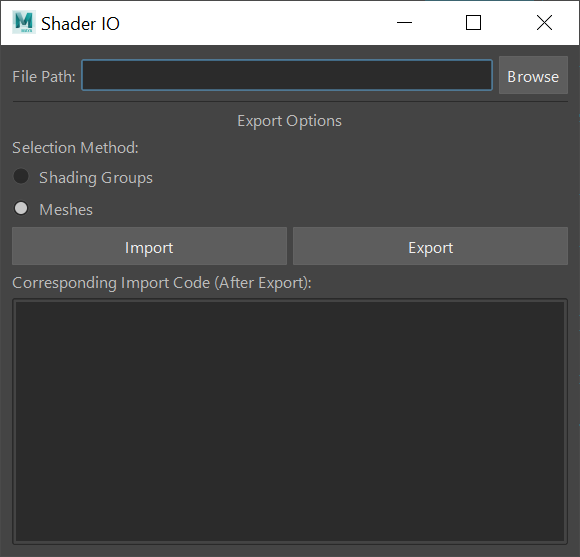

# Shader Input/Output Tool

Author: Eric Hug 



## Requirements
* Maya 2022 (with python 3) through 2024

## Installation
* Place downloaded folder into your local "maya/scripts" folder.
* Open Maya.
* Open Maya's Script Editor. In a Python tab, run the tool using the following python code:
```python
from importlib import reload
from shader_io import view
reload(view)
view.start_up()
```

## Usage
### Export
* **Step 1:** Choose a location on your computer to save the file to.
* **Step 2:** 
    * **Option A:** Export shaders by selecting shaded meshes in the scene. This will also save data regarding which selected meshes and mesh faces had the applied shader.
    * **Option B:** To export without mesh data, select the desired shaders' "shadingEngine" nodes located in the Hypershade window's **Shading Groups** tab.
### Import
* **Method 1:** After shaders are exported, python code is printed out in the textfield below, allowing the user to import the file quick and easy in a new file. Copy-and-paste the python code into Maya's Script Editor, and run it.
* **Method 2:** The same file path in the top textfield can also be used to import files. As long as the file exists, the user can simply press "Import".
